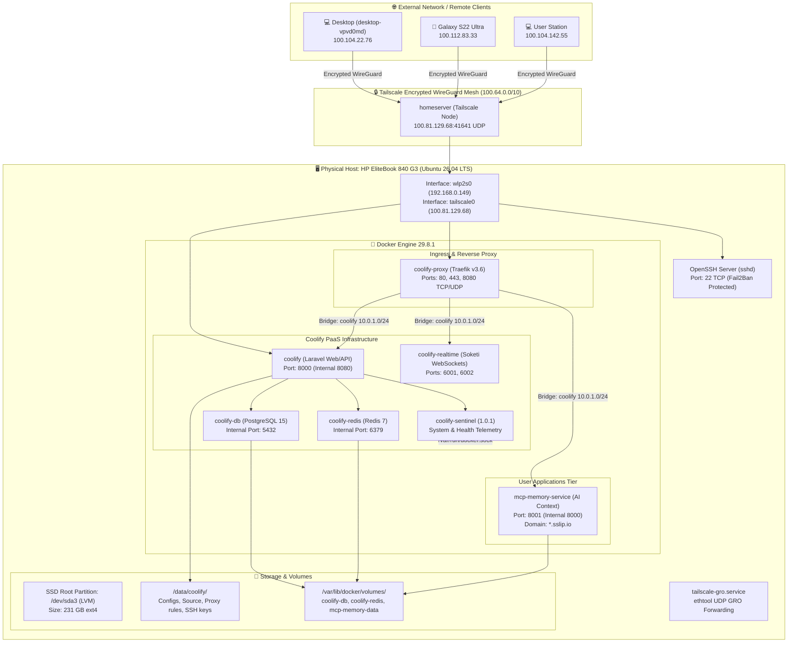

# 🏗️ System Architecture & Ingress Topology

This document details the architectural layout, ingress routing, network mesh, and storage model of the `homeserver` environment.

---

## 🗺️ High-Level Infrastructure Topology



---

## 🚦 Ingress Traffic Flow & Port Mapping

| Port (Host) | Protocol | Component | Target Container | Routing Policy / Domain |
| :--- | :--- | :--- | :--- | :--- |
| **22** | TCP | Host OpenSSH | Native (`sshd`) | Direct SSH with Fail2Ban protection |
| **80** | TCP | Traefik Reverse Proxy | `coolify-proxy` | HTTP Ingress / Auto-redirect to HTTPS |
| **443** | TCP / UDP | Traefik Reverse Proxy | `coolify-proxy` | HTTPS Ingress / HTTP/3 (QUIC) support |
| **6001 - 6002** | TCP | Soketi WebSockets | `coolify-realtime` | Real-time event broadcasting for Coolify |
| **8000** | TCP | Coolify Management UI | `coolify` | Main web management dashboard |
| **8001** | TCP | MCP Memory Service | `00lpnw9fxnqwf6f8lzonywhk` | Direct TCP fallback / API ingress |
| **8080** | TCP | Traefik Dashboard | `coolify-proxy` | Traefik diagnostic endpoint |
| **41641** | UDP | Tailscale WireGuard | Native (`tailscaled`) | Direct WireGuard transport communication |

---

## 🌐 Docker Networking Architecture

Docker manages an isolated bridge network dedicated to Coolify services:

```text
Bridge Name:       br-9c58423ac515
Docker Network:    coolify
Subnet:            10.0.1.0/24
IPv6 Subnet:       fd92:5548:7b6::/64
Gateway:           10.0.1.1
Attachable:        true
Scope:             local
```

### Communication Principles
1. **Container Isolation**: User services inside the `coolify` network communicate via container names or aliases (e.g. `coolify-db`, `coolify-redis`).
2. **Reverse Proxy Routing**: Incoming requests on Ports 80 and 443 are evaluated by Traefik dynamically using Docker labels (`traefik.enable=true`, `traefik.http.routers.*`).
3. **Internal Only DBs**: Databases (`coolify-db` on port 5432, `coolify-redis` on port 6379) are not published to host interfaces; they are only accessible to authorized containers within the bridge network.

---

## 💾 Storage Architecture & Persistence

```text
/dev/sda (256 GB SanDisk SSD)
├── sda1 (1.0 GB)  --> /boot/efi (FAT32, UEFI boot files)
├── sda2 (2.0 GB)  --> /boot (ext4, Kernel images & initramfs)
└── sda3 (235.4 GB) --> LVM Volume Group: ubuntu-vg
    └── ubuntu-lv (231 GB) --> Mountpoint: / (ext4)
        ├── /swap.img (4.0 GB swapfile)
        ├── /data/coolify/ (PaaS configurations, proxy rules, .env files)
        └── /var/lib/docker/volumes/
            ├── coolify-db (PostgreSQL database state)
            ├── coolify-redis (Redis in-memory snapshot state)
            └── 00lpnw9fxnqwf6f8lzonywhk-mcp-memory-data (SQLite vector / context database)
```
