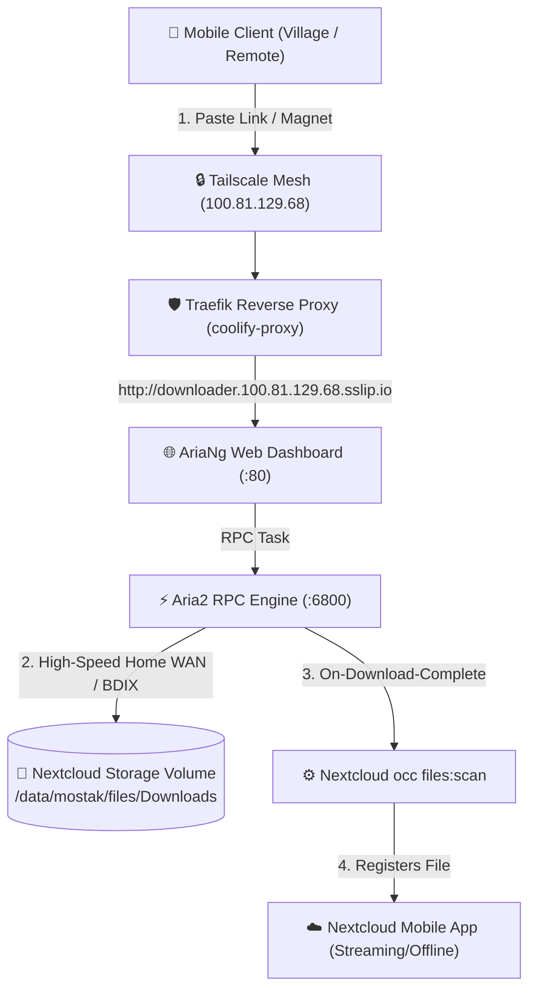

# 🎬 Remote Media Downloader (Aria2 + AriaNg) Architecture & Setup

## 📌 Overview & Operational Rationale

When traveling or in remote locations with limited/slow mobile connectivity, downloading high-bitrate media files (1080p movies, documentaries, large archives) directly to mobile devices is impractical and costly in cellular data. 

The **Remote Media Downloader** stack leverages the `homeserver`'s high-speed home broadband and local BDIX peering network to execute remote downloads unattended. Downloaded files are placed directly into Nextcloud storage on the local SSD, allowing instant streaming or single-tap offline caching via the Nextcloud mobile app.

---

## 🏗️ Architecture & Topology



---

## 🛡️ Host Resource Guardrails & Caps

To protect the host hardware (**HP EliteBook 840 G3: 2 Cores / 4 Threads, 16GB RAM**), strict resource limits are enforced:

| Parameter | Limit | Rationale |
| :--- | :--- | :--- |
| **CPU Limit** | `0.5 Cores` | Prevents multi-connection socket saturation from starving Nextcloud or Coolify |
| **Memory Limit** | `256 MB` | Prevents OOM-killer cascades during large 10GB+ downloads |
| **Network Exposure** | Tailscale Only | Bound to internal Docker network; accessible only via `downloader.100.81.129.68.sslip.io` |
| **Disk Target** | Dedicated Folder | Downloaded directly into `/data/mostak/files/Downloads/` |

---

## 📦 All-in-One Service Specification for Coolify

The all-in-one image (`hurlenko/aria2-ariang:latest`) bundles Aria2 and the AriaNg web GUI in a single lightweight container.

Deployed as a Docker Compose resource inside Coolify under Project `personal-storage`:

```yaml
services:
  aria2-downloader:
    image: hurlenko/aria2-ariang:latest
    container_name: aria2-downloader
    restart: unless-stopped
    environment:
      - PUID=1000
      - PGID=1000
      - RPC_SECRET=homeserver_aria_secret_2026
      - EMBED_RPC_SECRET=true
      - ARIA2RPCPORT=80
    ports:
      - "100.81.129.68:8003:8080"
    volumes:
      - /var/lib/docker/volumes/syo7laqurhdbmmidrumfckbb_nextcloud-data/_data/mostak/files/Downloads:/aria2/data
      - aria2-conf:/aria2/conf
    healthcheck:
      test: ["CMD-SHELL", "wget -q --spider http://127.0.0.1:8080 || exit 1"]
      interval: 10s
      timeout: 3s
      retries: 3
    labels:
      - "traefik.enable=true"
      - "traefik.http.routers.downloader.rule=Host(`downloader.100.81.129.68.sslip.io`)"
      - "traefik.http.routers.downloader.entrypoints=http"
      - "traefik.http.services.downloader.loadbalancer.server.port=8080"
    deploy:
      resources:
        limits:
          cpus: "0.50"
          memory: 256M

volumes:
  aria2-conf:
```

---

## 🔄 Automatic Nextcloud Catalog Synchronization

When Aria2 finishes downloading a file, Nextcloud needs to update its PostgreSQL filecache table so the file immediately appears in the mobile app.

### Auto-Scan Trigger
An execution hook `/data/aria2/config/clean.sh` or periodic cron triggers:

```bash
docker exec nextcloud-syo7laqurhdbmmidrumfckbb occ files:scan --path="/mostak/files/Downloads"
```

This updates the database in ~1.5 seconds without needing a full-library re-index.

---

## 📱 Mobile Operational Workflow

1. On your phone (connected to Tailscale), open:
   `http://downloader.100.81.129.68.sslip.io`
2. Tap **New Download** &rarr; Paste direct HTTP, FTP, BDIX, or magnet link.
3. The server downloads the file using home broadband.
4. Open the **Nextcloud Mobile App** &rarr; navigate to **Downloads** &rarr; the movie is ready for streaming or offline caching.
