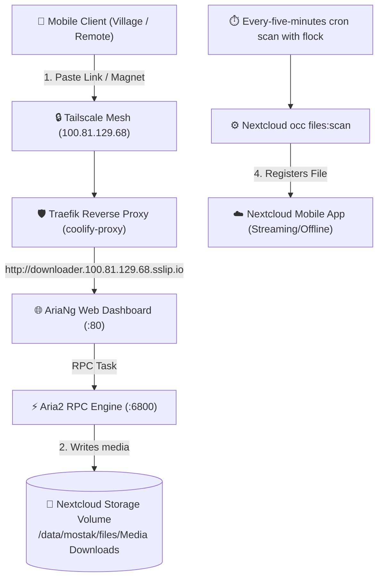

# 🎬 Remote Media Downloader (Aria2 + AriaNg) Architecture & Setup

## 📌 Overview & Operational Rationale

When traveling or in remote locations with limited/slow mobile connectivity, downloading high-bitrate media files (1080p movies, documentaries, large archives) directly to mobile devices is impractical and costly in cellular data. 

The **Remote Media Downloader** stack leverages the `homeserver`'s high-speed home broadband and local BDIX peering network to execute remote downloads unattended. Aria2 writes media into the dedicated Nextcloud `Media Downloads` folder on the local SSD, separate from ordinary files in `Downloads`.

---

## 🏗️ Architecture & Topology



---

## 🛡️ Host Resource Guardrails & Caps

To protect the host hardware (**HP EliteBook 840 G3: 2 Cores / 4 Threads, 16GB RAM**), strict resource limits are enforced:

| Parameter | Limit | Rationale |
| :--- | :--- | :--- |
| **CPU Limit** | `0.5 Cores` | Prevents multi-connection socket saturation from starving Nextcloud or Coolify |
| **Memory Limit** | `256 MB` | Prevents OOM-killer cascades during large 10GB+ downloads |
| **Network Exposure** | Tailscale Only | Bound to internal Docker network; accessible only via `downloader.100.81.129.68.sslip.io` |
| **Disk Target** | Dedicated Folder | Downloaded directly into `/data/mostak/files/Media Downloads/` |

---

## 📦 All-in-One Service Specification for Coolify

The all-in-one image (`hurlenko/aria2-ariang:latest`) bundles Aria2 and the AriaNg web GUI in a single lightweight container.

The Docker Compose resource is managed in Coolify under Project `personal-storage`:

```yaml
services:
  aria2-downloader:
    image: hurlenko/aria2-ariang:latest
    container_name: aria2-downloader
    restart: unless-stopped
    environment:
      - PUID=1000
      - PGID=1000
      - RPC_SECRET=REPLACE_WITH_YOUR_PRIVATE_SECRET
      - EMBED_RPC_SECRET=true
      - ARIA2RPCPORT=80
    ports:
      - "100.81.129.68:8003:8080"
    volumes:
      - "/var/lib/docker/volumes/syo7laqurhdbmmidrumfckbb_nextcloud-data/_data/mostak/files/Media Downloads:/aria2/data"
      - aria2-conf:/aria2/conf
    healthcheck:
      test: ["CMD-SHELL", "wget -q --spider http://127.0.0.1:8080 || exit 1"]
      interval: 10s
      timeout: 3s
      retries: 3
    labels:
      - "traefik.enable=true"
      - "traefik.http.routers.downloader.rule=Host(`downloader.100.81.129.68.sslip.io`)"
      - "traefik.http.routers.downloader.entrypoints=http"
      - "traefik.http.services.downloader.loadbalancer.server.port=8080"
    deploy:
      resources:
        limits:
          cpus: "0.50"
          memory: 256M

volumes:
  aria2-conf:
```

Create `Media Downloads` in the Nextcloud Files app before deploying this mount. The live folder is owned by UID/GID `1000:1000`, matching the container's `PUID` and `PGID`. Files already in the old `Downloads` folder are not moved automatically.

### Where to set the Aria2 secret

The repository's root `.env` can hold your `ARIA2_RPC_SECRET` as part of your private credential inventory. It is not loaded into the downloader automatically. Set the same value in the **Aria2 Docker Compose resource** in Coolify, not in Coolify's own `/data/coolify/source/.env`.

1. Open Coolify over Tailscale, then open **Projects** → **personal-storage** → the **Aria2 downloader** resource.
2. In its Compose configuration, find `RPC_SECRET=` under `aria2-downloader` → `environment`.
3. Replace `REPLACE_WITH_YOUR_PRIVATE_SECRET` with a new, long, random value. For example, run `openssl rand -hex 32` on your own machine and paste its output there. Do not put the value in this repository, screenshots, or chat.
4. Save and redeploy the resource in Coolify. Check that the container becomes healthy and that AriaNg can connect to Aria2 RPC.

The previously documented secret should be treated as exposed. If the running downloader still uses it, replace it with a new value during the next authorized deployment. The placeholder above is not a working secret.

---

## 🔄 Automatic Nextcloud Catalog Synchronization

Aria2 writes directly into the Nextcloud data directory. Since this bypasses Nextcloud's upload flow, `occ files:scan` must refresh Nextcloud's file cache for the files to appear in the app. No Aria2 completion hook is configured; the server scans every five minutes. New downloads can take up to five minutes to appear. `flock` prevents two copies of this scheduled scan from overlapping; it does not prevent uploads or lock files for Aria2.

### Auto-Scan Trigger
The cron entry should target the dedicated folder. Because the folder name contains a space, keep the path quoted:

```bash
*/5 * * * * /usr/bin/flock -n /home/mostak/.nextcloud-media-downloads-scan.lock /usr/bin/docker exec -u abc nextcloud-syo7laqurhdbmmidrumfckbb php /app/www/public/occ files:scan --path="/mostak/files/Media Downloads" > /dev/null 2>&1
```

To apply this on the server, run `crontab -e` and replace the existing downloader scan line with the entry above. A one-time scan of the new folder can be run with:

```bash
docker exec -u abc nextcloud-syo7laqurhdbmmidrumfckbb php /app/www/public/occ files:scan --path="/mostak/files/Media Downloads"
```

**Live change (2026-09-26):** Verified that `Media Downloads` exists and replaced the obsolete once-per-minute `/mostak/files/Downloads` scan with the five-minute entry above. A manual scan completed with zero errors; the folder contained no files at verification time. This verifies the scan command, not the appearance of a newly completed Aria2 download. The previous crontab is backed up under `/home/mostak/nextcloud-tuning-backups/20260926T064015Z/`.

---

## 📱 Mobile Operational Workflow

1. On your phone (connected to Tailscale), open:
   `http://downloader.100.81.129.68.sslip.io`
2. Tap **New Download** &rarr; Paste direct HTTP, FTP, BDIX, or magnet link.
3. The server downloads the file using home broadband.
4. Open the **Nextcloud Mobile App** &rarr; navigate to **Media Downloads** &rarr; the movie is ready for streaming or offline caching.

### Hide downloader progress files

Nextcloud excludes `.aria2` filenames using its native `forbidden_filename_extensions` setting (alongside `.part` and `.filepart`). This prevents resume files from appearing during the scheduled scan; it also blocks uploading `.aria2` files through Nextcloud. Aria2 continues to keep resume data on disk and manages completed-transfer cleanup. Do not delete control files merely because they are small; an interrupted download may need them. Verified 2026-09-26: two media files indexed, old 177-byte resume sidecar excluded, zero scan errors.
